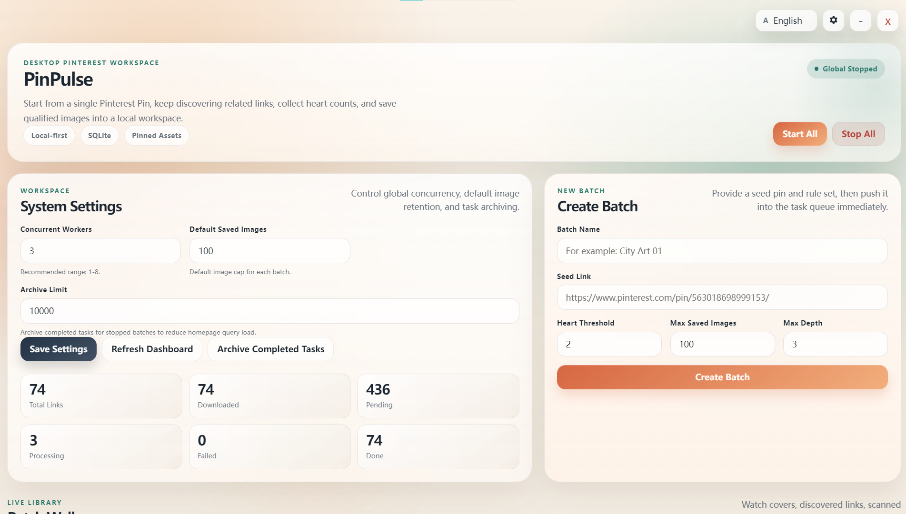

# PinPulse

[English](./README.md) | 简体中文

PinPulse 是一个桌面优先的 Pinterest Pin 抓取与本地图片工作台。它可以从单个 Pinterest 链接出发，逐层发现相关内容，统计 heart 数，并把符合规则的图片保存到本地数据库和图片目录中。

## 快速链接

- [English README](./README.md)
- [许可证](./LICENSE)

## 预览



## 核心特性

- Windows 桌面程序，可打包为单个 `exe`
- 按 batch 管理抓取任务，支持 `seed_url`、`threshold`、`max_images`、`max_depth`
- 本地 SQLite 数据库存储，图片保存到本地目录
- 内置代理设置，支持 `Direct`、`SOCKS5`、`HTTP`
- 支持多语言界面，默认英文，右上角可切换语言
- 每个 batch 会自动收敛数据规模，减少无用链接堆积

## 快速开始

### 开发运行

```bash
go run .
```

### Windows 打包

```bat
build-windows.bat
```

打包完成后，可执行文件输出到：

```text
bin\PinPulse.exe
```

## 使用帮助

### 1. 创建一个 batch

在首页右侧的 `Create Batch` 区域填写：

- `Batch Name`：给任务起一个便于识别的名字
- `Seed Link`：粘贴一个 Pinterest Pin 链接
- `Heart Threshold`：heart 阈值，默认是 `2`
- `Max Saved Images`：最多保存多少张图片，建议不要明显大于 `100`
- `Max Depth`：链接探索深度，通常建议 `2` 或 `3`

### 2. 参数建议

- `Heart Threshold = 2`
  这表示 heart 数达到 2 或以上的图片，才有机会进入保存结果
- `Max Saved Images = 100`
  数量越大，后面越容易混入不相似的图片
- `Max Depth = 2`
  超过 2 层后，相关性通常会明显下降

### 3. 启动抓取

创建完成后，按下面顺序操作：

1. 进入对应 batch
2. 点击 `Start Batch`
3. 如需让全局调度器开始工作，再点击首页上的 `Start All`

### 4. 查看结果

在 batch 详情页中：

- `View Original Link`：打开原始 Pinterest 页面
- `Locate`：如果图片已下载到本地，则在资源管理器中定位文件；如果本地文件不存在，则打开图片源链接
- 右上角齿轮按钮：设置代理
- 右上角语言下拉：切换界面语言

## 数据存储

默认数据目录：

- 开发环境：`./data/`
- Windows 打包版：`bin\PinPulse.exe` 同级或旁边的 `data/`
- 可通过 `PINPULSE_DATA_DIR` 或 `--data-dir` 自定义

主要文件：

- 数据库：`data/app.db`
- 图片目录：`data/images/`
- 前端源码：`web/`

## 网络与代理

PinPulse 支持以下网络模式：

- 直连
- SOCKS5 代理
- HTTP 代理

代理设置位于界面右上角的齿轮按钮中。不配置代理时，程序默认使用本机直连。

## 页面与接口

- `/`：仪表盘
- `/batch/{id}`：batch 详情页
- `/api/health`：启动健康检查

## 技术栈

- Go
- SQLite
- Vanilla JavaScript

## 注意事项

- 本项目与 Pinterest 无官方关联
- 请确认你的使用方式符合目标网站的条款、频率限制、版权规则与当地法律
- 本工具适合本地研究、素材整理与自动化工作流，不建议用于高风险或违规用途

## 需要更多定制软件？

如果你需要定制软件、自动化流程、AI 工具，或需要把现有业务做成桌面工具 / 数据采集工具，可以通过下面的联系方式沟通。

## 联系邮箱


